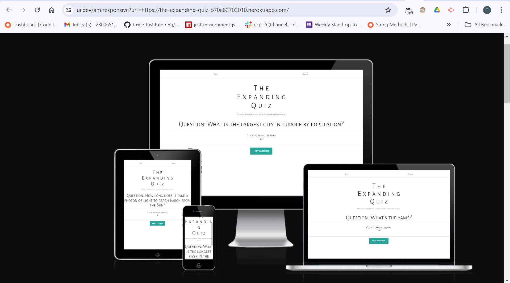
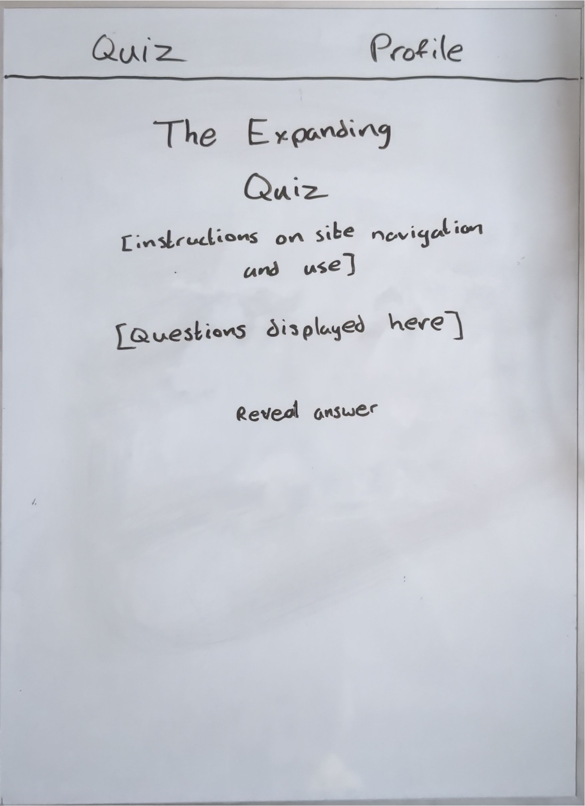
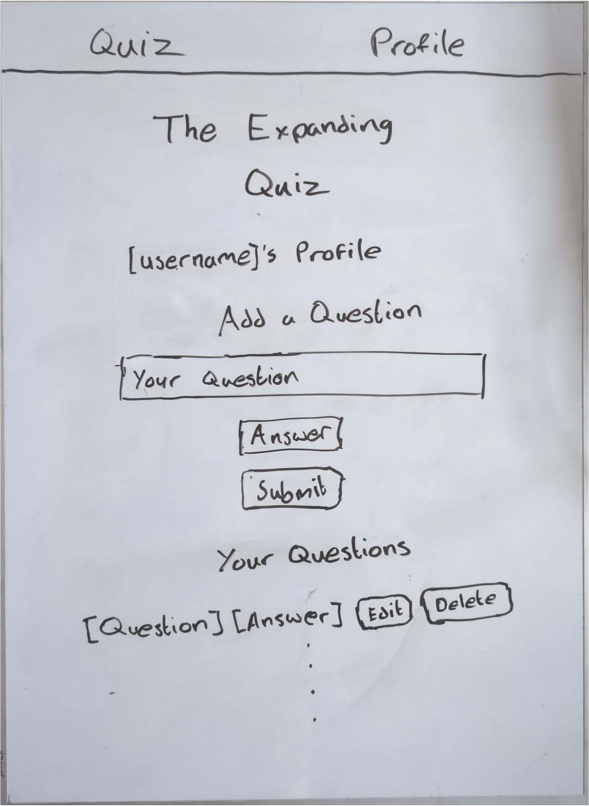
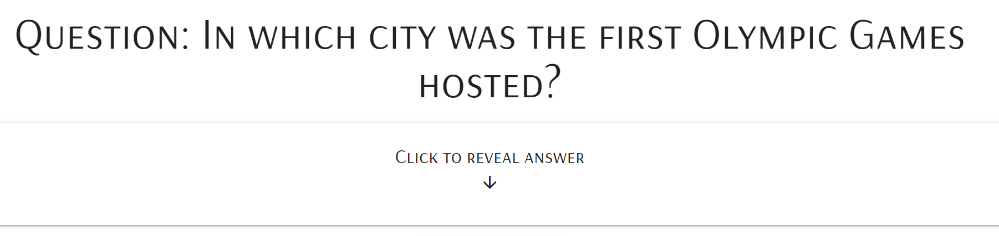
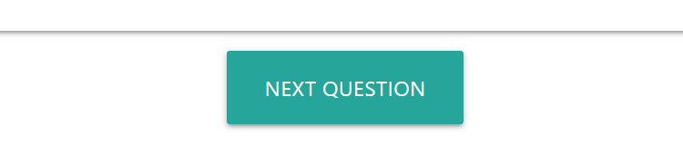
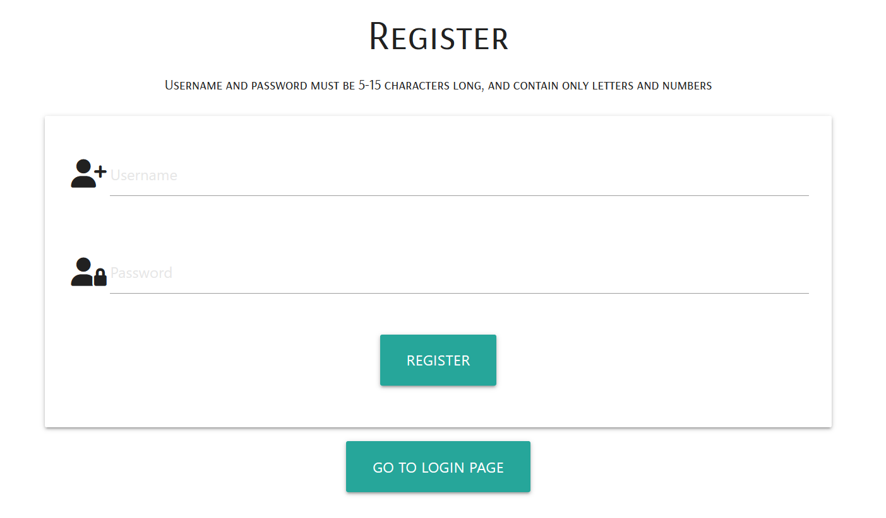
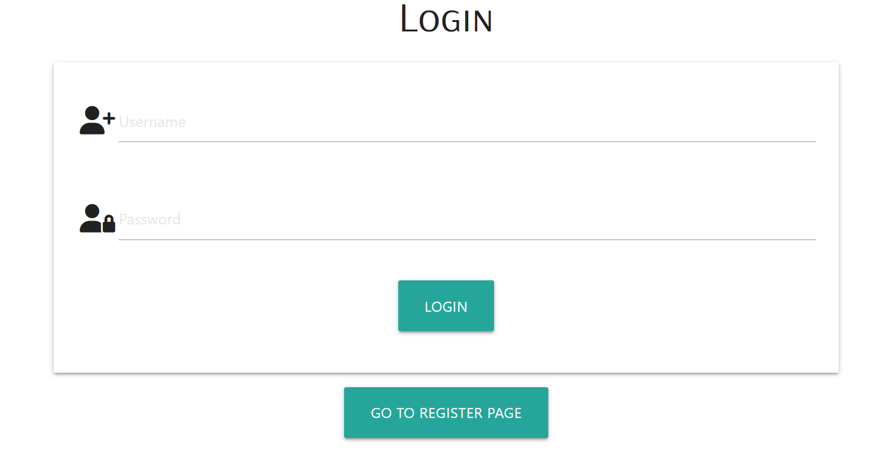
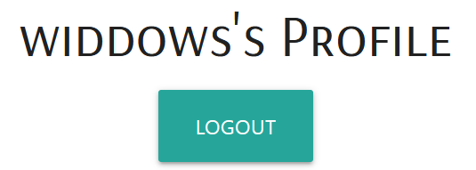
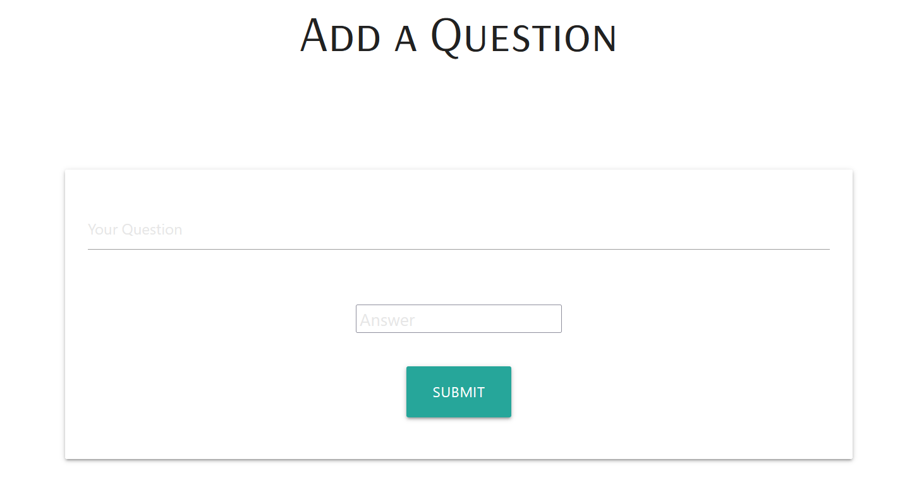
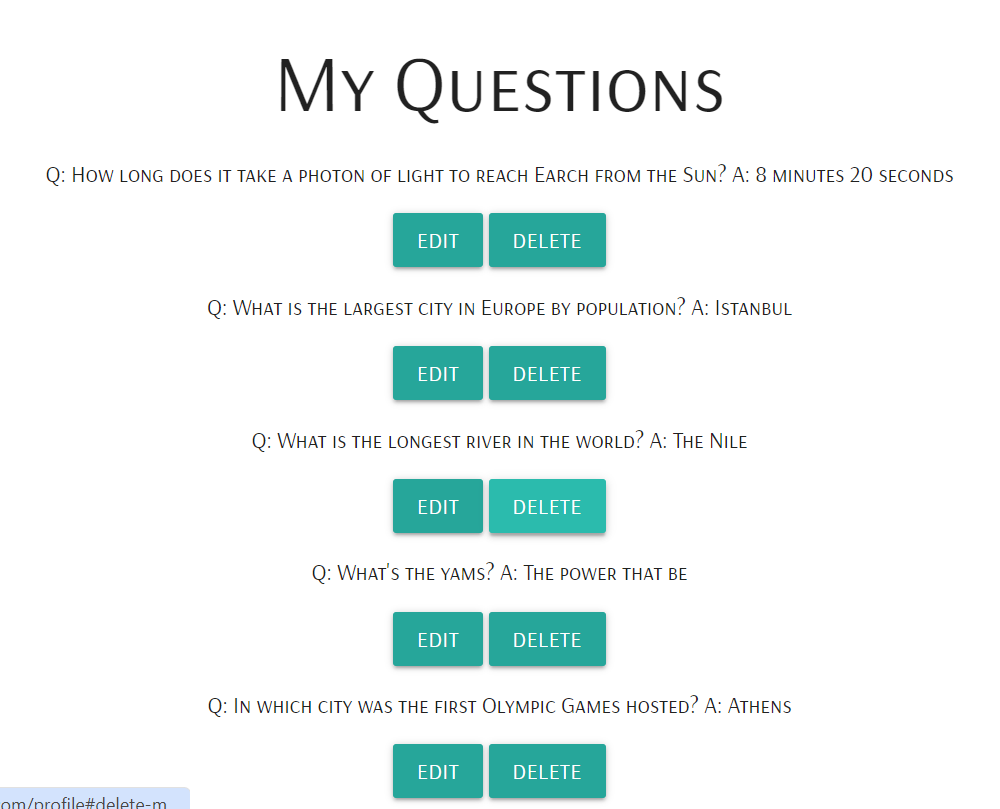

# The Expanding Quiz

!

## Website Goals

### Customer Goals

- Easily access a database of randomised quiz questions
- Test knowledge with friends and/or family
- Input own questions to expand database and encourage other users
- Navigate site easily and intuitively, with instructions to follow where needed

### Business Goals

- Create a mutable database of quiz questions
- Create a community of quizzers that can mentally challenge one another
- Display questions one at a time within a web application
- Allow users to input their own questions and answers
- Allow users to remove their own questions and answers
- Allow users to flag any incorrecly uploaded questions and/or answers
- Regulate quiz questions as administrator by checking validity of questions and answers

## User Experience

### Potential Users

- Groups of friends/family that want to do a quiz for fun
- People training for a quiz
- People that want to join an online group of quizzers

### User Stories

__New User__

- I want to know what the site is about
- I want the site navigation to be intuitive and quick
- I want to have fun
- I want to upload my own questions for other people to view

__Returning User__

- I want to be able to upload more questions
- I want to view my uploaded questions
- I want to be able to edit or delete my questions and answers
- I want to know if others disagree with my answer
- I want to know if an administrator has removed my question

__Site Administrator__

- The page should be easily manageable
- The code should be well commented
- The code should contain safeguards to prevent the user from breaking the game intentionally or unintiaonally
- I should have overriding power for deleting questions/changing answers if appropriate

## Wireframes

  

## Features

__Question__

| Feature | Page | Screenshot | Notes |
| --- | --- | --- | --- |
| Question & Answer | index.html | ! | Uses flask and jinjia templates to retrieve question_info from run.py which has already chosen a raondom question upon page load. Answer card doesn't reveal answer until arrow is clicked |
| Next Question Button | index.html |  | Links to index route decorator, reloading the page with a new question. Previous question's id was stored in SHOWN_QUESTION_IDS constant so will not be shown again. |
| Login & Register Pages | login.html, register.html |   | Both forms are styled identically. Each page has a button linking to the other page. Placeholders and icons increase ease of accessibility |
|  Profile & Logout | profile.html |  | Profile name displayed using jinja templating. Logout button links to /logout route decorator. Styled identically to Login/Register buttons |
| Add a Question | profile.html |  | Similar form to login and register forms. Links to /add_quesiton route decorator |
| Edit/delete Questions | profile.html |  | Buttons link to edit/delete modal popup where forms are filled in and the database is updated. |

## Future Features

I Want to add a Flag Questions/Answers feature, where users who are displayed a question can flag it. This means that the person who uploaded that question, as well as any administrators (myself) would be alerted that there is an issue with the question. There would be two options for flagging a question; either the answer may be wrong, or the question is inappropriate (maybe it is not a question, maybe it is offensive). If a user believes the answer is wrong, They can suggest a correction and if this correction cets a certain number of upvotes, it would replace the original answer. If a question gets flat a lot of times for being inappropriate, it would get deleted. 