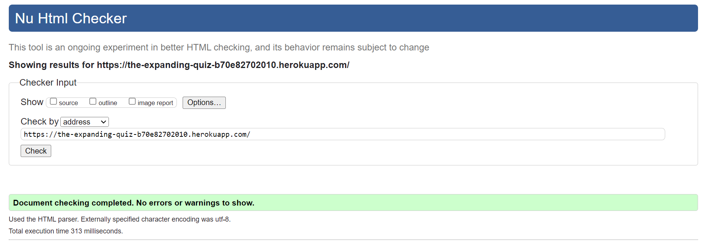
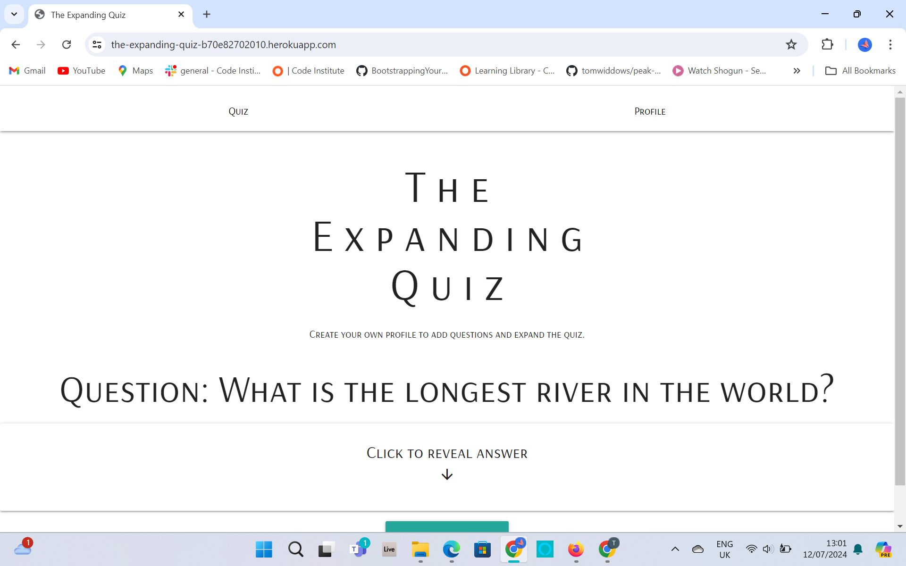
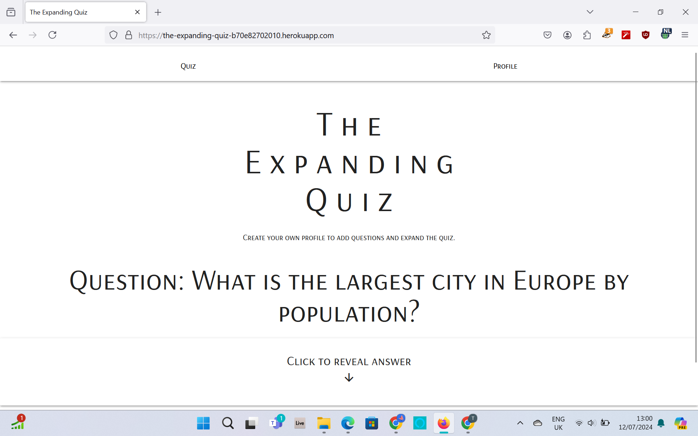

# HTML Validation

| Page | W3C URL | Screenshot | Notes |
| --- | --- | --- | --- |
| Quiz | [W3C](https://validator.w3.org/nu/?doc=https%3A%2F%2Fthe-expanding-quiz-b70e82702010.herokuapp.com%2F) |  | Two errors fixed: role not required; button must not descend from a tag |
| Login or Register | [W3C](https://validator.w3.org/nu/?doc=https%3A%2F%2Fthe-expanding-quiz-b70e82702010.herokuapp.com%2Flogin_or_register) |  | No errors |
| Login | [W3C](https://validator.w3.org/nu/?doc=https%3A%2F%2Fthe-expanding-quiz-b70e82702010.herokuapp.com%2Flogin_page%3F) |  |No Errors  |
|  Register | [W3C](https://validator.w3.org/nu/?doc=https%3A%2F%2Fthe-expanding-quiz-b70e82702010.herokuapp.com%2Fregister_page%3F) |  | No Errors |
|  Profile | [W3C](https://validator.w3.org/nu/?doc=https%3A%2F%2Fthe-expanding-quiz-b70e82702010.herokuapp.com%2Fprofile) |  | No Errors |

# CSS Validation

| File | Jigsaw URL | Screenshot | Notes |
| --- | --- | --- | --- |
| style.css | [Jigsaw](https://jigsaw.w3.org/css-validator/validator?uri=https%3A%2F%2Fthe-expanding-quiz-b70e82702010.herokuapp.com%2F&profile=css3svg&usermedium=all&warning=1&vextwarning=&lang=en) |  | There was one error, as well as many warnings, but these have come from the Materialize code. |

# Browser Compatibility

| Browser | Screenshot | Notes |
| --- | --- | --- |
| Chrome |  | Works as expected |
| Firefox |  | Works as expected |
| Edge |  | Works as expected |